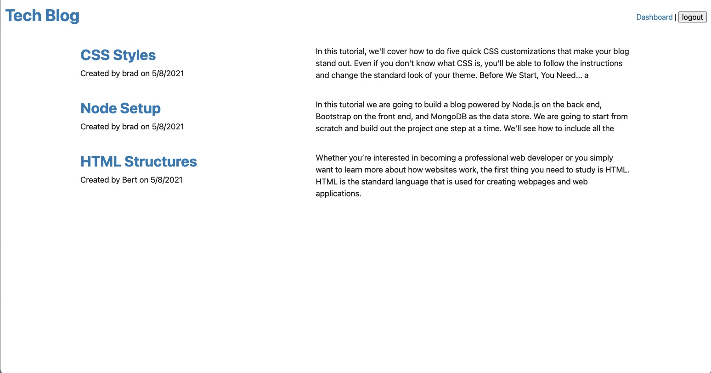
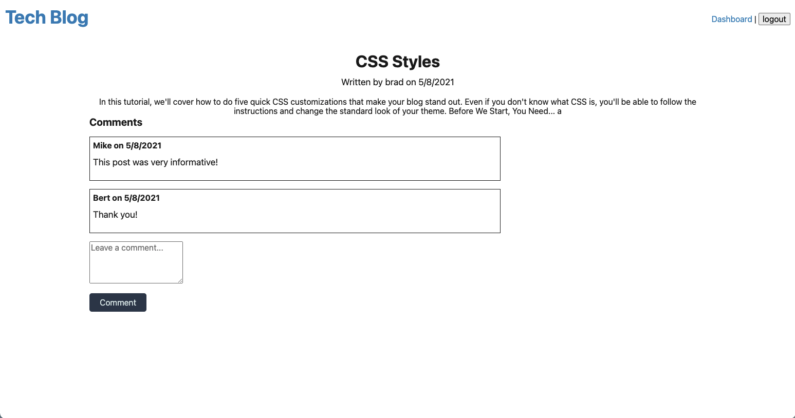
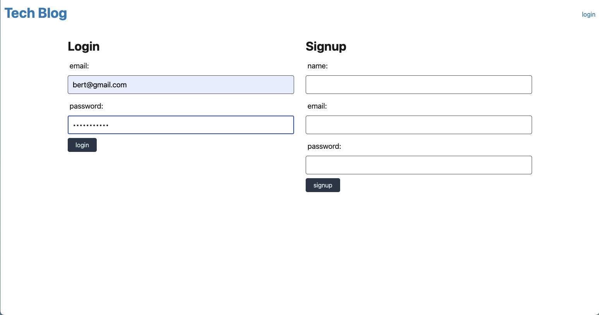
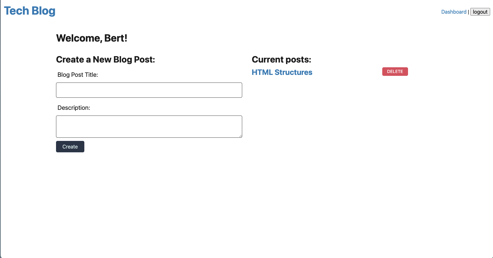

# Tech Blog MVC

## Project Description

This is a tech blog that follows the MVC structure. In this project, a user can view a list posted blog posts, the user can click into one of the posts to see more detailed information. The user has the option to login or create a new account. When logged in. the user can view their dashboard where they can see posts they have created or create a new post. The user can also comment on posts when logged in.

## Project Screenshots

## Link to Deplayed Project on Heroku

https://morning-bayou-73467.herokuapp.com/

## Background

This project was really interesting as I frequent tech blogs. In addition, I was also very curious about how to go about handling multiple users and user registration on a site.

## Learnings

Throughout this project I learned a lot more about CRUD operations and DOM manipulation.

## Challenges

Sending information from the DOM to the database was one of the most challenging things for me. Another chanllege was polling the correct information into the handlebars file.

## Usage

Follow the above Heroku link to the fully deployed application. Once on the app, the user can freely navigate between the homepage, individual bog post pages, the login page or the dashboard page.

## Credits

Thank you to Columbia's Full-Stack Web Developer bootcamp for all the assistance and for teaching me all that I have learned.

## Licence

Copyright (c) 2021 Steven Stefanov

Permission is hereby granted, free of charge, to any person obtaining a copy
of this software and associated documentation files (the "Software"), to deal
in the Software without restriction, including without limitation the rights
to use, copy, modify, merge, publish, distribute, sublicense, and/or sell
copies of the Software, and to permit persons to whom the Software is
furnished to do so, subject to the following conditions:

The above copyright notice and this permission notice shall be included in all
copies or substantial portions of the Software.

THE SOFTWARE IS PROVIDED "AS IS", WITHOUT WARRANTY OF ANY KIND, EXPRESS OR
IMPLIED, INCLUDING BUT NOT LIMITED TO THE WARRANTIES OF MERCHANTABILITY,
FITNESS FOR A PARTICULAR PURPOSE AND NONINFRINGEMENT. IN NO EVENT SHALL THE
AUTHORS OR COPYRIGHT HOLDERS BE LIABLE FOR ANY CLAIM, DAMAGES OR OTHER
LIABILITY, WHETHER IN AN ACTION OF CONTRACT, TORT OR OTHERWISE, ARISING FROM,
OUT OF OR IN CONNECTION WITH THE SOFTWARE OR THE USE OR OTHER DEALINGS IN THE
SOFTWARE.